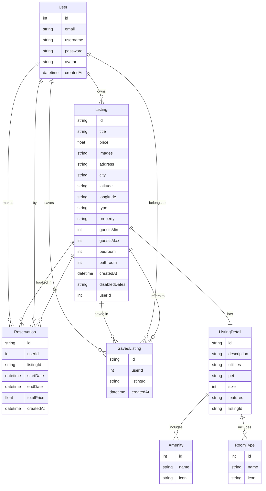

# Zentra B&B 


## Project Overview

This is a full-stack bed and breakfast (B&B) search application that supports user registration, listing creation, property search, and reservation functionalities. The platform is built with a separation-of-concerns architecture to ensure maintainability, and clear data flow between client and server.

``` Demo:``` https://zentra-bnb-frontend.onrender.com/

## Table of Contents
- Features
- Architecture Overview
- Data Schema
- API Documentation
- Known Issues / TODO
- Getting Started

## Features

- User registration and authentication
- Search and filter listings by criteria
- View detailed listing data
- Display of available and reserved dates
- Save (favorite) listings
- Upload and manage listings

## Architecture Overview
This project aims to reflect practical and modern development workflows with attention to maintainable code structure, predictable deployments, and developer experience.

- **Frontend**: Built with React and TypeScript to ensure accurate, dynamic, and responsive data presentation. Shared types are used across the stack to maintain consistency and prevent type duplication.
- **Backend**: Implemented as a RESTful API using Node.js, Express, and Prisma ORM with PostgreSQL as the database. This stack provides efficient development and reliable relational data management.
- **Shared Package**: A TypeScript-based shared package is used to publish and consume common types across frontend and backend, reducing errors and promoting consistent API contracts.

## Infrastructure

- **Containerization**: The application uses Docker to simulate production runtime in local development. `docker-compose` is configured to orchestrate services and provide a reproducible environment.
- **CI/CD Pipeline**: GitHub Actions is used to build production-ready Docker images. The CI pipeline validates changes and prepares deployable artifacts.
- **Deployment**: The application is currently deployed on Render, which builds and serves the app directly from the Docker configuration in the repository.


## 🧩 Data Schema

The backend uses a relational PostgreSQL database managed by Prisma ORM. Below is a high-level entity-relationship diagram:




## Backend API

### Auth Routes (`/api/auth`)

| Method | Endpoint               | Description                         |
|--------|------------------------|-------------------------------------|
| GET    | `/api/auth/currentuser` | Get the currently authenticated user |
| POST   | `/api/auth/register`    | Register a new user account         |
| POST   | `/api/auth/login`       | Authenticate user and issue token   |
| POST   | `/api/auth/logout`      | Logout user and clear session       |

### Listing Routes (`/api/listing`)

| Method | Endpoint                 | Description                              |
|--------|--------------------------|------------------------------------------|
| GET    | `/api/listing/`          | Get all listings with filters            |
| GET    | `/api/listing/:id`       | Get details of a single listing          |
| POST   | `/api/listing/`          | Add a new listing (auth required)        |
| DELETE | `/api/listing/:id`       | Delete a listing (auth required)         |
| POST   | `/api/listing/save`      | Save a listing to favorites (auth)       |
| DELETE | `/api/listing/save/:id`  | Unsave a listing (auth required)         |

### Reservation Routes (`/api/reservation`)

| Method | Endpoint                    | Description                                 |
|--------|-----------------------------|---------------------------------------------|
| POST   | `/api/reservation/`         | Create a reservation for a listing (auth)   |
| DELETE | `/api/reservation/:id`      | Cancel a reservation (auth required)        |

### User Routes (`/api/user`)

| Method | Endpoint               | Description                                 |
|--------|------------------------|---------------------------------------------|
| GET    | `/api/user/listings`   | Get listings created by the current user    |
| GET    | `/api/user/saved`      | Get listings saved by the current user      |

---

### API Response Format & DTOs

All successful responses follow a consistent structure via a generic `ApiResponse<T>` class from the shared types package.

✅ Success Response

```
{
  success: true,
  data: T,
}
```
❌ Error Response
```
{
  success: false,
  errors: [{
    message: string,
    field?: string,
  }],
}
```


## Shared Types
A private or published npm package provides common interfaces and types used across the full stack:

- Data Models: e.g. User, Listing, Reservation
```
export type UserData = {
  id: number;
  email: string;
  username: string;
  avatar: string | null;
  createdAt: Date;
};

export type Listing = {
  id?: string;
  title: string;
  price: number;
  images: string[];
  address: string;
  city: string;
  latitude: string;
  longitude: string;
  type: ListingType;
  property: PropertyType;
  guestsMin: number;
  guestsMax: number;
  bedroom: number;
  bathroom: number;

  createdAt?: Date;
  userId?: number;
  listingDetail?: ListingDetail;
  user?: { username: string; avatar: string | null };
  isSaved?: boolean;
  disabledDates?: Date[];
};

export enum ListingType {
  STAY = "stay",
  RENT = "rent",
}

export enum PropertyType {
  HOUSE = "house",
  APARTMENT = "apartment",
  CABIN = "cabin",
  VILLA = "villa",
  OTHER = "other",
}

export type ListingDetail = {
  id?: string;
  description: string;
  utilities?: string;
  pet?: string;
  size?: number;

  amenities?: Amenity[];
  features?: string[];
  roomTypes?: RoomType[];
  listingId?: string;
};

export type Reservation = {
  id: string;
  userId: number;
  listingId: string;
  startDate: Date;
  endDate: Date;
  totalPrice: number;
  createdAt: Date;

  user?: UserData;
  listing?: Listing;
};

```

- DTOs: e.g. CreateListingParams, CreateReservationParams
```
export interface GetListingsQuery {
  city?: string;
  type?: ListingType;
  property?: PropertyType;
  //   bedroom?: string;
  minPrice?: string;
  maxPrice?: string;
  guests?: string;
  startDate?: Date;
  endDate?: Date;
}

export interface CreateListingParams {
  listing: {
    title: string;
    price: number;
    images: string[];
    address: string;
    city: string;
    latitude: string;
    longitude: string;
    type: ListingType;
    property: PropertyType;
    guestsMin: number;
    guestsMax: number;
    bedroom: number;
    bathroom: number;
  };
  listingDetail: {
    description: string;
    utilities?: string;
    pet?: string;
    size?: number;

    amenities?: { id: number }[];
    features?: string[];
    roomTypes?: { id: number }[];
  };
}

export interface CreateReservationParams {
  listingId: string;
  startDate: Date;
  endDate: Date;
  totalPrice: number;
}
```

- Api Response Types: ApiResponse<T>, ErrorResponse
```
export interface ApiError {
  message: string;
  field?: string;
}

export interface ApiResponse<T = any> {
  success: boolean;
  message?: string;
  data?: T;
  errors?: ApiError[];
}
```

## Known Issues / TODO
- Implement reservation function with better display and tracking components
- Better validation UX in user input form
- Improve filter search
- Location data autofill
- Add integration tests
- Implement review/rating system
- Improve error handling and logging


## Getting Started (local dev)

### Prerequisites

- Docker & Docker Compose
- Node.js >= 18
- Npm
- Database connection string

### Setup environment

- For local development, each service should have its own .env file (create one if not exist). Set up database connection string, jwt key, and client/server url in the .env file.
- Ensure the client and server url uses the same port number as configured for the service in the /docker-compose.dev.yml file

### Run with Docker Compose
```bash
docker-compose -f .\docker-compose.dev.yml up --build
```
